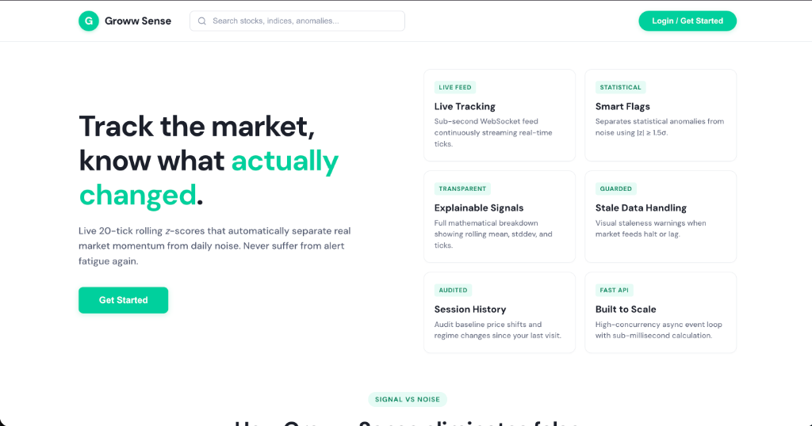
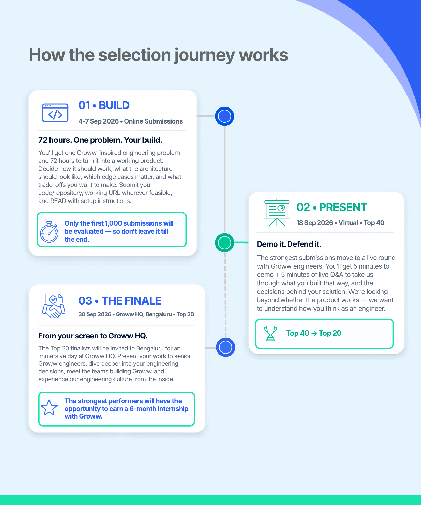
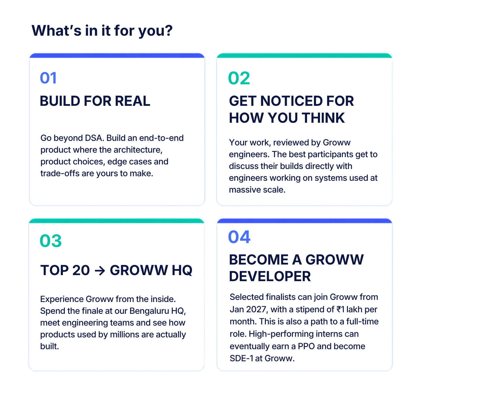

# Groww Sense

Groww Sense tracks short-term equity price movements and surfaces statistically unusual changes using rolling z-scores instead of static percentage alerts.

🔗 **Live Deployment:** [https://groww-sense-market-signals.onrender.com](https://groww-sense-market-signals.onrender.com)  
📦 **GitHub Repository:** [https://github.com/eekshitaandhavarapu/Groww-Sense-Market-Signals](https://github.com/eekshitaandhavarapu/Groww-Sense-Market-Signals)

---

## Screenshots

### 1. Starting Page & Overview


### 2. Live Watchlist Dashboard (Flagged vs. Quiet Zones)


### 3. Statistical Explainability Panel & Volatility Band


---

## The Problem

Traditional watchlists rely on flat percentage changes (e.g., "+1.8% today"). This creates two major issues:

1. **False Alarms on Volatile Stocks:** A 2% swing in a high-beta stock like Tata Motors is standard intraday noise.
2. **Missed Anomalies on Stable Stocks:** The same 2% swing in a low-beta, defensive stock like Nestlé India represents a significant 3-sigma event.

Standard watchlists treat both movements identically, causing alert fatigue and obscuring actionable market signals.

---

## The Solution

Groww Sense evaluates every incoming tick against that specific stock's recent volatility profile. 

- Maintains an in-memory rolling window of the last **20 ticks** per instrument.
- Computes real-time rolling mean ($\mu$), standard deviation ($\sigma$), and standard score ($z$).
- Segregates stocks into two distinct visual zones:
  - **Flagged Zone:** Promotes stocks with $|z| \ge 1.5\sigma$ to the top with amber/red severity badges.
  - **Quiet Zone:** Keeps ordinary market noise ($|z| < 1.5\sigma$) compact and unobtrusive.
- Provides a 1-click **Explainability Panel** and **20-tick Signal Replay Scrubber** so users can inspect the exact mathematical progression leading to an alert.

---

## Statistical Methodology

$$\mu = \frac{1}{N} \sum_{i=1}^{N} p_i, \quad \sigma = \sqrt{\frac{1}{N} \sum_{i=1}^{N} (p_i - \mu)^2}, \quad z = \frac{p_{\text{current}} - \mu}{\sigma}$$

Where $N = 20$ ticks.

### Signal Classification Matrix

| Classification | Statistical Condition | Watchlist Behavior | UI Accent |
|---|---|---|---|
| **Noise** | $\|z\| < 1.5\sigma$ | Retained in Quiet zone | Neutral gray |
| **Notable** | $1.5\sigma \le \|z\| < 2.5\sigma$ | Promoted to Flagged zone | Amber badge (`+1.8σ`) |
| **Meaningful** | $\|z\| \ge 2.5\sigma$ | Highlighted at top of Flagged zone | Red badge + Plain-English alert breakdown |

### Edge-Case Handling

- **Cold Start ($len < 20$ ticks):** Falls back to flat percentage thresholds ($\ge 1.5\%$ for notable, $\ge 3.0\%$ for meaningful) until 20 ticks accumulate.
- **Zero Variance Protection:** Protects against division by zero using $\epsilon = 10^{-9}$ when prices are completely flat.
- **Stale / Duplicate Rejection:** Discards ticks with timestamps less than or equal to the instrument's last recorded tick timestamp.
- **Price Floor:** Random walk simulation is bounded at a minimum price of `1.0`.

---

## Architecture & Data Flow

```
[Simulated Market Feed / Price Generator]
                 │ (2-second ticks via asyncio loop)
                 ▼
     [Change Detection Service]
                 │ 1. Validate monotonic timestamp
                 │ 2. Compute rolling mean, stddev, z-score
                 │ 3. Classify: Noise | Notable | Meaningful
                 ▼
      [In-Memory Redis Adapter / Redis 7]
                 │ LPUSH tick history (N=20)
                 │ PUBLISH to watchlist channel
                 ▼
       [FastAPI WebSocket Router]
                 │ Stream JSON frames (/ws/watchlist/{id})
                 ▼
         [React 19 Frontend]
                 │ Zustand Store + TanStack Query
                 │ Two-Zone Layout (Flagged / Quiet)
                 │ Recharts Volatility Band (Price, Mean, ±1σ)
                 ▼
             [User UI]
```

---

## Technology Stack

### Frontend
- **Framework:** React 19 with TypeScript
- **Bundler:** Vite
- **State Management:** Zustand (real-time tick caching & socket state)
- **Data Fetching:** TanStack Query v5 (REST cache & fallback refetching)
- **Charts:** Recharts (20-tick volatility curve & $\pm 1\sigma$ envelopes)
- **Styling:** Custom Vanilla CSS Design System with tabular numerical alignment

### Backend
- **Framework:** Python 3.12 + FastAPI + Uvicorn
- **ORM / Database:** SQLAlchemy 2.0 (AsyncIO) + SQLite (`aiosqlite` for single-container local/cloud deploy) / PostgreSQL (`asyncpg`)
- **Migrations:** Alembic
- **Caching & Pub/Sub:** In-memory Redis adapter (zero external dependencies) / Redis 7
- **Validation:** Pydantic v2

---

## Demo Data Feed

The application includes an in-process market feed simulator calibrated across 12 Indian equities with realistic volatility parameters:

- **High Volatility:** Tata Motors (`TATAMOTORS`, vol 0.030), Adani Enterprises (`ADANIENT`, vol 0.028), Reliance Industries (`RELIANCE`, vol 0.025)
- **Medium Volatility:** Infosys (`INFY`, vol 0.012), HDFC Bank (`HDFCBANK`, vol 0.011), TCS (`TCS`, vol 0.010), Wipro, ICICI Bank, SBI
- **Low Volatility (Defensive):** Nestlé India (`NESTLEIND`, vol 0.005), Hindustan Unilever (`HINDUNILVR`, vol 0.004), Pidilite (`PIDILITIND`, vol 0.005)

The simulator generates new ticks every 2 seconds via a Geometric Brownian Motion model and introduces a 5% deliberate stale-tick probability to exercise validation logic.

---

## Project Structure

```
GrowwSense/
|-- README.md             # Project documentation & evaluator guide
|-- Dockerfile            # Unified multi-stage build (Node frontend + Python backend)
|-- render.yaml           # Render cloud deployment specification
|-- docker-compose.yml    # Multi-container setup (Postgres + Redis + App)
|-- package.json          # Root workspace scripts
|-- run.sh                # Zero-dependency local startup script
|-- docs/
|   \-- screenshots/      # Application screenshots
|-- backend/
|   |-- app/
|   |   |-- main.py       # FastAPI application entrypoint & static mount
|   |   |-- config.py     # Environment settings & CORS
|   |   |-- database.py   # Async SQLAlchemy engine
|   |   |-- models/       # User, Watchlist, Instrument, LastSeen tables
|   |   |-- routers/      # REST API endpoints & WebSocket handler
|   |   |-- services/     # Change detection & baseline diff logic
|   |   \-- simulator/    # 12-instrument price generator
|   |-- alembic/          # Database schema migrations
|   \-- requirements.txt  # Python backend dependencies
\-- frontend/
    |-- src/
    |   |-- components/   # WatchlistView, ExplainPanel, SignalReplay, etc.
    |   |-- store/        # Zustand real-time market store
    |   |-- api/          # TanStack query clients & fetch wrapper
    |   \-- index.css     # Design tokens & responsive styles
    \-- package.json      # Frontend dependencies
```

---

## Running Locally

### Option 1: Single Startup Script (Zero External Dependencies)

Runs the backend (using SQLite and embedded memory Redis) and frontend together without requiring Docker:

```bash
./run.sh
```

- **Application:** [http://localhost:5173](http://localhost:5173) (or [http://localhost:5173/?page=landing](http://localhost:5173/?page=landing))
- **Interactive Swagger Docs:** [http://localhost:8000/docs](http://localhost:8000/docs)
- **API Health Check:** [http://localhost:8000/api/health](http://localhost:8000/api/health)

---

### Option 2: Docker (Single Command)

Builds the unified multi-stage container and starts PostgreSQL, Redis, and the web server:

```bash
docker compose up -d
```

- **Application & API:** [http://localhost:8000](http://localhost:8000)
- **Swagger Docs:** [http://localhost:8000/docs](http://localhost:8000/docs)

---

### Option 3: Manual Startup (Two Terminals)

#### Terminal 1 — Backend
```bash
cd backend
pip install -r requirements.txt
alembic upgrade head
python scripts/seed.py
python -m uvicorn app.main:app --host 0.0.0.0 --port 8000 --reload
```

#### Terminal 2 — Frontend
```bash
npm install
npm run dev
```

---

## Evaluator Walkthrough Guide

Follow these steps to test the core features:

1. **Starting Page:** Open the live link [https://groww-sense-market-signals.onrender.com](https://groww-sense-market-signals.onrender.com). Review the product pillars and click **"Get Started"**.
2. **Watchlist Dual Zones:** Observe how stocks with routine fluctuations remain in the Quiet zone, while stocks experiencing sudden deviation are promoted to the Flagged zone.
3. **Data Health & Feed Status:** Inspect the Data Health bar at the top displaying active socket state, tick count, and live latency.
4. **Inspect Signal Calculation:** Click any stock (e.g., *Tata Motors* or *Nestlé India*) to open the **ExplainPanel**. Review the breakdown of rolling mean ($\mu$), rolling standard deviation ($\sigma$), price delta, and $z$-score.
5. **Volatility Envelope Chart:** View the price curve plotted against running mean and $\pm 1\sigma$ standard deviation bands.
6. **20-Tick Signal Replay:** Click **"Replay Signal Sequence"** in the ExplainPanel to launch the interactive scrubber. Step backward and forward through the 20 ticks leading up to the flagged anomaly.
7. **Session History:** Click the **History** tab to inspect recorded regime changes (Notable, Meaningful, Normalized) and compare current prices against your *"Since You Last Checked"* baseline.
8. **Insights & Volatility Breakdown:** Click the **Insights** tab to view sector dispersion and portfolio volatility distributions.
9. **Simulate Stale Data:** Click **"Pause Stream"** in the Data Health bar to test how the UI handles stalled market feeds. Click **"Resume"** to reconnect.
